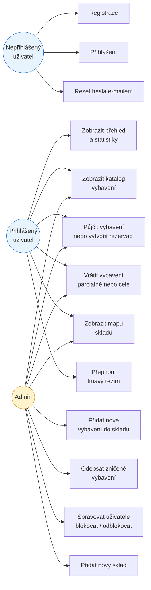

# Správa oddílového vybavení (SOV)

Webová aplikace pro správu majetku a výpůjček vybavení skautského oddílu.  
Školní projekt — Gymnázium Delta, 2024/2025.

**Živá aplikace:** https://b2024michvo.delta-www.cz  
**Backend API:** https://sklad-backend.skladbackend.workers.dev

---

## Účel aplikace

Oddíl vlastní desítky stanů, nástrojů, kuchyňského vybavení a dalšího majetku uloženého ve více skladech. Vedoucí i členové si věci vzájemně půjčují na výpravy a akce. Bez systému vznikají konflikty — dvě skupiny si zarezervují stejný stan na stejný víkend.

Aplikace řeší:
- **Přehled majetku** — co oddíl vlastní, kde to leží, kolik kusů je volných
- **Výpůjčky a rezervace** — kdo si co půjčil, na jak dlouho, s detekcí konfliktů
- **Odpisy** — evidenci zničeného/ztraceného vybavení s důvodem
- **Správu uživatelů** — admin může blokovat účty, vidí historii přihlášení

---

## Struktura projektu

```
sklad-web/
├── frontend/               # React + TypeScript (Vite)
│   ├── public/
│   │   ├── service-worker.js   # PWA offline cache
│   │   └── manifest.json       # PWA manifest
│   └── src/
│       ├── api.ts              # centrální URL backendu
│       ├── main.tsx            # vstupní bod, dark mode init
│       ├── App.tsx             # routing + providery
│       ├── contexts/
│       │   ├── AuthContext.tsx         # globální stav přihlášení
│       │   └── NotificationContext.tsx # toast notifikace
│       ├── components/
│       │   ├── Header.tsx          # navigační lišta
│       │   ├── ProtectedRoute.tsx  # ochrana stránek
│       │   └── Notifications.tsx   # vykreslení toastů
│       ├── hooks/
│       │   └── useDarkMode.ts  # dark/light mode s localStorage
│       └── pages/
│           ├── Login.tsx, Register.tsx, Activation.tsx
│           ├── ForgotPassword.tsx, ResetPassword.tsx
│           ├── Dashboard.tsx   # přehled + vrácení výpůjček
│           ├── Borrowings.tsx  # katalog + půjčení/rezervace
│           ├── Equipment.tsx   # vybavení + odpisy
│           ├── Map.tsx         # mapa skladů
│           └── Admin.tsx       # správa uživatelů
│
└── backend/                # Hono.js na Cloudflare Workers
    ├── schema.sql           # definice databáze (D1/SQLite)
    └── src/
        ├── index.ts         # vstupní bod, CORS, routy
        ├── types.ts         # TypeScript typy (Bindings, AuthUser)
        ├── crypto.ts        # hashování hesel (PBKDF2 / Web Crypto API)
        ├── sessions.ts      # správa session tokenů
        ├── middleware.ts    # ověření přihlášení, admin check
        ├── mailer.ts        # odesílání e-mailů (Resend API)
        └── routes/
            ├── auth.ts      # registrace, přihlášení, reset hesla
            ├── equipment.ts # vybavení a odpisy
            ├── borrowings.ts# výpůjčky a rezervace
            ├── locations.ts # sklady
            └── admin.ts     # správa uživatelů
```

---

## Použité technologie

| Část | Technologie |
|------|-------------|
| Frontend | React 18, TypeScript, Vite, React Bootstrap 5 |
| Backend | Hono.js, Cloudflare Workers (serverless) |
| Databáze | Cloudflare D1 (SQLite na edge) |
| Autentizace | Session cookie (HttpOnly, SameSite=None) |
| Hashování hesel | PBKDF2 přes Web Crypto API (100 000 iterací, SHA-256) |
| E-maily | Resend HTTP API |
| PWA | Service Worker + Web App Manifest |
| Lokální úložiště | localStorage (téma), HttpOnly cookie (session) |

---

## Databázové schéma

```sql
users        -- id, name, email, password_hash, role, is_active, is_blocked, login_count
sessions     -- token, user_id, expires_at
auth_tokens  -- token, user_id, purpose (email_verify / password_reset)
locations    -- id, name, address
equipment    -- id, name, category, total_quantity, available_quantity, location_id
borrowings   -- id, user_id, equipment_id, quantity, date_from, date_to, status, note
discard_logs -- id, equipment_id, user_id, quantity, reason, created_at
```

---

## API endpointy

### Autentizace (`/api/auth`)
| Metoda | Endpoint | Popis |
|--------|----------|-------|
| POST | `/api/auth/register` | Registrace nového uživatele, odesílá aktivační e-mail |
| GET | `/api/auth/activate?token=` | Aktivace účtu z odkazu v e-mailu |
| POST | `/api/auth/login` | Přihlášení — nastaví session cookie |
| POST | `/api/auth/logout` | Odhlášení — smaže session z DB i cookie |
| GET | `/api/auth/authcheck` | Ověří platnost session, vrátí data uživatele |
| POST | `/api/auth/forgot-password` | Odešle reset e-mail |
| POST | `/api/auth/reset-password` | Nastaví nové heslo pomocí tokenu |

### Vybavení (`/api/equipment`) — vyžaduje přihlášení
| Metoda | Endpoint | Popis |
|--------|----------|-------|
| GET | `/api/equipment` | Seznam veškerého vybavení s dostupností |
| POST | `/api/equipment/add` | Přidání nového vybavení *(pouze admin)* |
| POST | `/api/equipment/remove` | Odpis (vyřazení) kusů se zadáním důvodu *(pouze admin)* |
| GET | `/api/equipment/discards` | Historie odpisů |

### Výpůjčky (`/api/borrowings`) — vyžaduje přihlášení
| Metoda | Endpoint | Popis |
|--------|----------|-------|
| POST | `/api/borrowings/create` | Vytvoření výpůjčky nebo rezervace |
| POST | `/api/borrowings/return` | Vrácení (částečné nebo celé) + případný odpis |
| GET | `/api/borrowings/conflicts/:id` | Kdo má daný předmět aktuálně půjčený/rezervovaný |
| GET | `/api/borrowings/my-history` | Historie výpůjček přihlášeného uživatele |
| GET | `/api/borrowings/history` | Celková historie *(pouze admin)* |

### Sklady (`/api/locations`) — vyžaduje přihlášení
| Metoda | Endpoint | Popis |
|--------|----------|-------|
| GET | `/api/locations` | Seznam skladů s vybavením a aktuálními výpůjčkami |
| POST | `/api/locations/add` | Přidání nového skladu *(pouze admin)* |

### Správa uživatelů (`/api/admin`) — vyžaduje admin roli
| Metoda | Endpoint | Popis |
|--------|----------|-------|
| GET | `/api/admin/users` | Seznam všech uživatelů s aktivitou |
| PATCH | `/api/admin/users/:id/block` | Přepnutí blokování uživatele (toggle) |

---

## Princip fungování

### Autentizace (Session-based)
1. Uživatel se přihlásí → backend ověří heslo (PBKDF2), vygeneruje náhodný token (32 B hex)
2. Token se uloží do tabulky `sessions` s dobou platnosti (7 dní)
3. Token se pošle jako **HttpOnly cookie** — JavaScript k němu nemá přístup (bezpečnost)
4. Každý chráněný request přiloží cookie automaticky (`credentials: 'include'`)
5. Backend přečte cookie, ověří token v DB a zjistí, kdo posílá request

### Globální stav (AuthContext)
- Při startu aplikace se jednou zavolá `/api/auth/authcheck`
- Výsledek (přihlášený uživatel nebo null) se uloží do React Context
- Všechny komponenty k datům přistupují přes hook `useAuth()` bez dalších API volání

### Ochrana routů (ProtectedRoute)
- Každá chráněná stránka je zabalena do `<ProtectedRoute>`
- Dokud běží authcheck → spinner (žádné bliknutí přesměrování)
- Nepřihlášen → redirect na `/login`
- Přihlášen, ale ne admin (pro admin stránky) → redirect na `/dashboard`

### PWA a offline režim
- Service Worker cachuje odpovědi z API endpointů pro vybavení, výpůjčky a sklady
- Při ztrátě připojení aplikace zobrazí uložená data z cache a informuje uživatele notifikací
- Statické soubory (JS, CSS) jsou cachovány s Cache-First strategií
- HTML stránky nejsou nikdy cachovány (vždy ze sítě) — aby se po nasazení nové verze nenačetla stará

### Hashování hesel
Cloudflare Workers nepodporují Node.js `bcrypt`. Místo toho se používá **PBKDF2** přes nativní Web Crypto API:
```
heslo + salt (náhodných 16 B) → PBKDF2-SHA256 (100 000 iterací) → hash
uloženo ve formátu: "saltHex:hashHex"
```

### Detekce konfliktů rezervací
Když si uživatel chce vzít věc okamžitě (active), systém zkontroluje budoucí rezervace ostatních. Pokud by okamžitá výpůjčka ohrozila plánovanou výpravu, zobrazí se varování s konkrétním datem, do kdy musí uživatel věci vrátit.

---

## Use-case diagram



---

## Lokální spuštění

### Požadavky
- Node.js 18+
- Účet na Cloudflare (pro D1 databázi)

### Backend
```bash
cd backend
npm install
# Vytvoř databázi lokálně
npx wrangler d1 execute oddil-db --local --file=schema.sql
# Spusť vývojový server
npm run dev
```

### Frontend
```bash
cd frontend
npm install
# Vytvoř soubor .env
echo "VITE_API_URL=http://localhost:8787" > .env
npm run dev
```

---

## Nasazení

### Backend (Cloudflare Workers)
```bash
cd backend
npm run deploy
```

### Frontend (Apache hosting)
```bash
cd frontend
npm run build
# Obsah složky dist/ nahrej na hosting přes FTP
```
